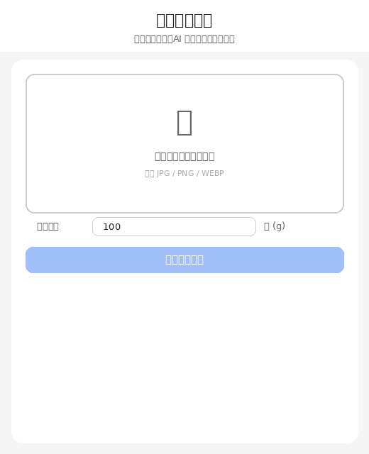

# 🍱 食物热量识别 | Food Calorie Estimator

> 上传一张食物照片，AI 自动识别食物种类并估算热量。支持中西餐任意食物。
> Upload a food photo — AI identifies the dish and estimates its calories. Works for any food worldwide.

**在线体验 / Live Demo：[huggingface.co/spaces/alex0027/food-calories](https://huggingface.co/spaces/alex0027/food-calories)**

**开源代码 / Source Code：[github.com/Anqi00/food](https://github.com/Anqi00/food)**


---

## 效果预览



---

## 功能

- **任意食物识别**：基于 Google Gemini 视觉模型，支持中西餐所有食物，包括烤鱼、麻辣烫、寿司、披萨等
- **热量估算**：识别后输入克重，自动计算总热量
- **估计重量**：不知道重量？点击「估计重量」按钮，自动填入该食物的典型份量
- **拖拽上传**：支持拖拽或点击上传 JPG / PNG / WEBP

---

## 技术栈

| 模块 | 技术 |
|------|------|
| 食物识别 | [通义千问-VL](https://dashscope.aliyun.com/)（阿里 Qwen-VL 多模态视觉模型） |
| 热量数据 | Qwen-VL 直接估算 + USDA FoodData Central 备用数据 |
| 后端 | Python + FastAPI |
| 前端 | 原生 HTML / CSS / JS |
| 部署 | Hugging Face Spaces（Docker） |

---

## 在线使用

直接访问 👉 **[https://huggingface.co/spaces/alex0027/food-calories](https://huggingface.co/spaces/alex0027/food-calories)**

无需安装，打开即用。

---

## 本地运行

```bash
git clone https://github.com/Anqi00/food.git
cd food

python3 -m venv venv
source venv/bin/activate      # Windows: venv\Scripts\activate

pip install -r requirements.txt

# 创建 .env 文件，填入你的 DashScope API key（从 dashscope.aliyun.com 获取）
echo "DASHSCOPE_API_KEY=sk-你的key" > .env

uvicorn app:app --reload
```

打开 [http://localhost:8000](http://localhost:8000)

---

## 项目结构

```
food/
├── app.py              # FastAPI 路由
├── model.py            # Gemini 视觉识别
├── calories_db.json    # 热量备用数据库（101 种食物）
├── Dockerfile
├── requirements.txt
└── templates/
    └── index.html      # 前端页面
```

---

## 热量计算

```
总热量 (kcal) = 食物重量 (g) × 每 100g 热量 (kcal) ÷ 100
```

热量数据由 Gemini 估算，参考 USDA FoodData Central，仅供参考。

---

## License

MIT
